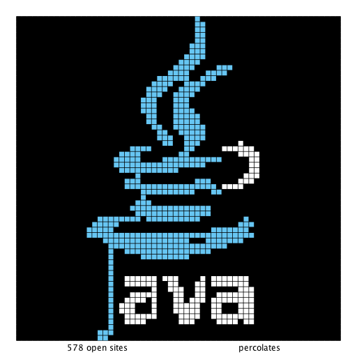

# percolation
 A percolation threshold simulator model created as part of Princeton's Algorithms Coursera course. 

### To run
- Run `PercolationVisualizer.java` to see a visualizer of a percolation model
- Run `PercolationStats.java` to see the percolation stats on a random grid fill in

#### Visualization Example

#### Video Demo

